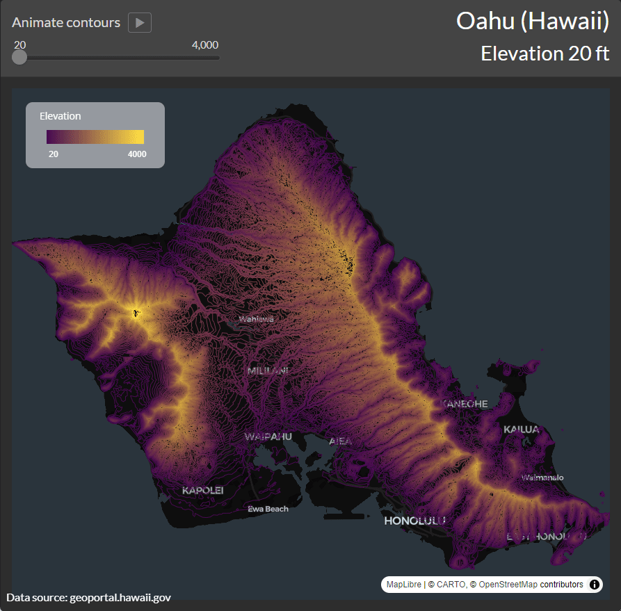

# Hawaii elevation contours

I recently went on a trip to Honolulu, Hawaii, and was quite fascinated by some of the paper maps that I saw there. I also saw a [Tableau visualization](https://public.tableau.com/app/profile/alexandervar/viz/Hawaii_elevation/HawaiiElevation) by [Alexander Varlamov](https://www.linkedin.com/in/alexander-varlamov-8359054a/) and got curious about building elevation contour maps for Hawaiian islands in R! Below you will find the contour maps for the eight Hawaiian islands that make up the state of Hawaii and an animation visualizing the 20 ft contours for Oahu.

## Oahu contour animation

I tried creating a Shiny app to mimic what Alexander Varlamov [posted on Reddit](https://www.reddit.com/r/dataisbeautiful/comments/m0aztx/oc_elevation_lines_of_oahu_hawaii/). It's not as slick as Alexander's visualization, but it's my humble attempt at recreating it.

## Hawaii

There is an island called Hawaii in the state of Hawaii!

## Kahoolawe

## Kauai

## Lanai

## Maui

## Molokai

## Niihau

## Oahu

## Acknowledgements

I want to thank [Alexander Varlamov](https://www.linkedin.com/in/alexander-varlamov-8359054a/) for the inspiration and [Kyle Walker](https://www.linkedin.com/in/walkerke/) for his [mapgl R package](https://walker-data.com/mapgl/) that I have used heavily in this project.

## License

Maps are licensed under the [Creative Commons Attribution-ShareAlike 4.0 International license (CC BY-SA 4.0)](https://creativecommons.org/licenses/by-sa/4.0/), and the source files are licensed under the [MIT license](https://ashirwad-barnwal.mit-license.org/).
